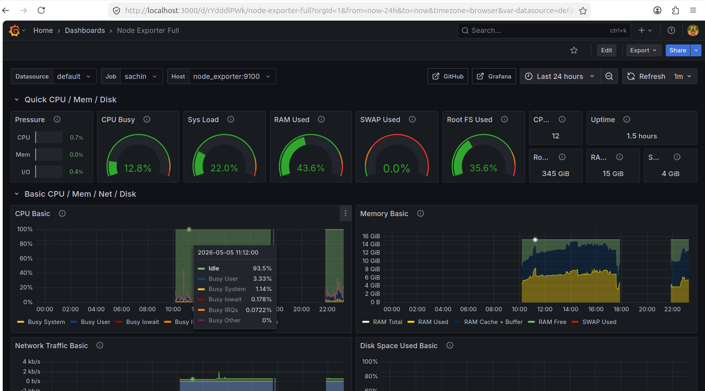
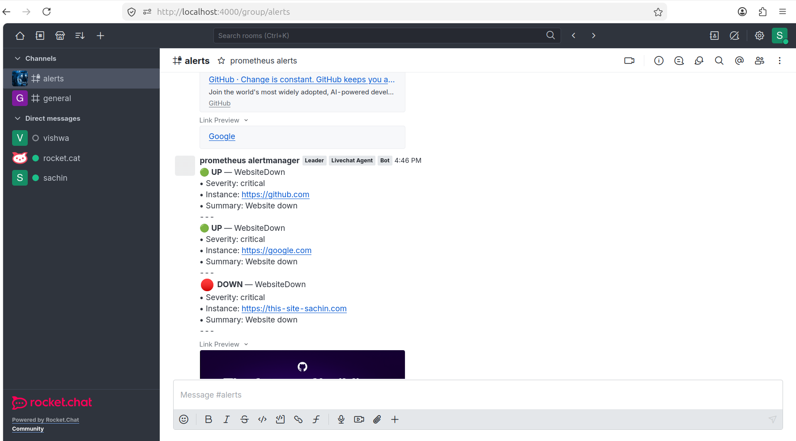
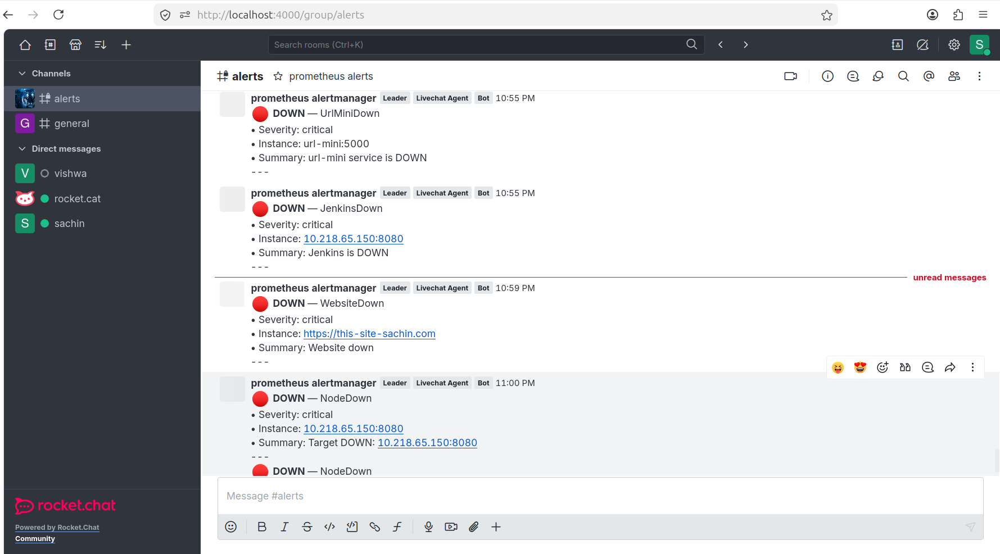
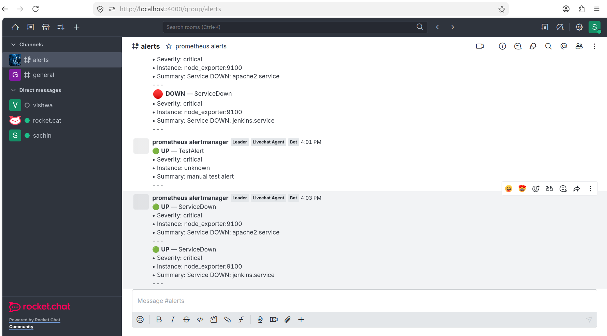
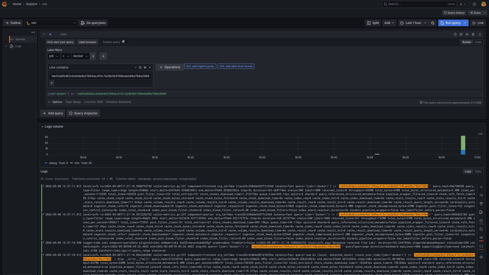

# 🔭 Observability Stack

A production-pattern monitoring and alerting stack built with Prometheus, Grafana, Loki, and Alertmanager — fully containerized with Docker, alerting to Rocket.Chat in real time.


---

## 📐 Architecture

```
┌─────────────────────────────────────────────────────────────────┐
│                        Docker Network: monitoring               │
│                                                                 │
│  ┌──────────────┐     scrape     ┌─────────────────────────┐   │
│  │ node_exporter│◄───────────────│                         │   │
│  │   :9100      │                │      Prometheus         │   │
│  ├──────────────┤                │        :9090            │   │
│  │   Blackbox   │◄───────────────│                         │   │
│  │   :9115      │                │  - metrics collection   │   │
│  ├──────────────┤                │  - rule evaluation      │   │
│  │   Jenkins    │◄───────────────│  - alert firing         │   │
│  │   :8080      │                └────────────┬────────────┘   │
│  └──────────────┘                             │ alert          │
│                                               ▼                │
│  ┌──────────────┐                ┌─────────────────────────┐   │
│  │    Promtail  │──── push ─────►│      Alertmanager       │   │
│  │    :9080     │                │        :9093            │   │
│  └──────┬───────┘                │  - routing              │   │
│         │ push logs              │  - deduplication        │   │
│         ▼                        │  - silencing            │   │
│  ┌──────────────┐                └────────────┬────────────┘   │
│  │     Loki     │                             │ webhook        │
│  │    :3100     │                             ▼                │
│  └──────┬───────┘                ┌─────────────────────────┐   │
│         │                        │      Rocket.Chat        │   │
│         ▼                        │        :4000            │   │
│  ┌──────────────┐                │  🔥 FIRING alerts       │   │
│  │   Grafana    │◄───────────────│  ✅ RESOLVED alerts     │   │
│  │    :3000     │  datasources   └─────────────────────────┘   │
│  └──────────────┘                                               │
└─────────────────────────────────────────────────────────────────┘
```

---

## 🧱 Stack Components

| Component | Role | Port |
|---|---|---|
| **Prometheus** | Metrics collection & alert rule evaluation | 9090 |
| **Node Exporter** | Host metrics (CPU, RAM, Disk) + systemd services | 9100 |
| **Blackbox Exporter** | HTTP/HTTPS endpoint probing | 9115 |
| **Alertmanager** | Alert routing, deduplication, notifications | 9093 |
| **Grafana** | Visualization (metrics + logs) | 3000 |
| **Loki** | Log aggregation | 3100 |
| **Promtail** | Log collection agent | 9080 |
| **Rocket.Chat** | Alert notification receiver | 4000 |

---

## 📊 What Gets Monitored

### System Metrics (via Node Exporter)
- CPU usage per core
- Memory utilization
- Disk space and I/O
- Network throughput
- System load average

### Systemd Services (via Node Exporter systemd collector)
- `apache2.service`
- `nginx.service`
- `jenkins.service`
- `ssh.service`
- `docker.service`

### HTTP Endpoints (via Blackbox Exporter)
- External URLs — up/down status
- Response time
- SSL certificate expiry (alerts at <30 days)

### Logs (via Promtail → Loki)
- System logs (`/var/log/syslog`)
- Auth logs (`/var/log/auth.log`)
- Application logs

---

## 🚨 Alert Rules

### System Alerts
| Alert | Condition | Severity |
|---|---|---|
| `HighCPU` | CPU > 80% for 2m | warning |
| `HighMemory` | Memory > 85% for 2m | warning |
| `DiskSpaceLow` | Disk > 80% for 5m | warning |
| `HighLoad` | Load avg > 5 for 2m | warning |

### Service Alerts
| Alert | Condition | Severity |
|---|---|---|
| `ServiceDown` | systemd service not active for 1m | critical |
| `ServiceFailed` | systemd service in failed state | critical |

### HTTP Alerts
| Alert | Condition | Severity |
|---|---|---|
| `WebsiteDown` | probe_success == 0 for 1m | critical |
| `WebsiteSlowResponse` | response > 3s for 2m | warning |
| `SSLCertExpiringSoon` | cert expiry < 30 days | warning |
| `JenkinsDown` | Jenkins unreachable for 1m | critical |

---

## 🔔 Alert Notifications (Rocket.Chat)

Alerts fire to a Rocket.Chat channel via incoming webhook with a custom script:

```
🔥 FIRING — ServiceDown
• Severity: critical
• Instance: node_exporter:9100
• Summary: Service DOWN: apache2.service

✅ RESOLVED — ServiceDown
• Severity: critical
• Instance: node_exporter:9100
• Summary: Service DOWN: apache2.service
```

---
## 🔗 Creating Webhook for Alertmanager (Rocket.Chat)

### Step 1: Create Incoming Webhook
* First Create User **prometheus-boat** 
* Then Go to **Administration → Integrations**
* Click **New Integration → Incoming WebHook**

Fill:

* Enabled → ON
* Name → `prometheus-alerts`
* Post to Channel → `#alerts`
* Username → `prometheus-boat`
* Alias → `Prometheus Alertmanager`
* Avatar URL →

  ```
  https://prometheus.io/assets/favicons/android-chrome-192x192.png
  ```

---

### ⚠️ Important

Enable **Script Enabled → ON**

Otherwise, Rocket.Chat will only show notification without message content.

---

### Step 2: Add Script

```javascript
class Script {
  process_incoming_request({ request }) {
    try {
      const body = request.content;
      const alerts = body.alerts;

      if (!alerts || alerts.length === 0) {
        return { content: { text: "⚠️ Alertmanager sent empty payload" } };
      }

      let text = "";

      alerts.forEach(alert => {
        const status = (alert.status || "").toLowerCase();

        // Map states clearly
        let stateText = "";
        let emoji = "";

        if (status === "firing") {
          stateText = "DOWN";
          emoji = "🔴";
        } else if (status === "resolved") {
          stateText = "UP";
          emoji = "🟢";
        } else {
          stateText = status.toUpperCase();
          emoji = "⚠️";
        }

        const name = alert.labels.alertname || "Unknown";
        const severity = alert.labels.severity || "unknown";
        const summary = alert.annotations.summary || "No summary";
        const instance = alert.labels.instance || "unknown";

        text += `${emoji} *${stateText}* — ${name}\n`;
        text += `• Severity: ${severity}\n`;
        text += `• Instance: ${instance}\n`;
        text += `• Summary: ${summary}\n`;
        text += `---\n`;
      });

      return { content: { text } };

    } catch (e) {
      return { content: { text: "Script error: " + e.toString() } };
    }
  }
}
```

---

## 🚀 Quick Start

### Prerequisites
- Docker + Docker Compose
- Linux host (Ubuntu 22.04 recommended)
- Rocket.Chat instance (or swap for Slack — see below)

### 1. Create Docker network
```bash
docker network create monitoring
```

### 2. Clone and configure
```bash
git clone https://github.com/Sachin-Viru/observability-stacks.git
cd observability-stack
```

### 3. Set your Rocket.Chat webhook URL
```bash
# edit alertmanager/alertmanager.yml
# replace the webhook url with your own
```

### 4. Start the stack
```bash
# Start core monitoring
docker compose -f prometheus/prometheus-compose.yml up -d
docker compose -f node-exporter/node-exporter.yml up -d
docker compose -f alertmanager/alertmanager-container.yml up -d
docker compose -f blackbox/blackbox-compose.yml up -d

# Start log stack
docker compose -f loki/loki-compose.yml up -d
docker compose -f promtail/promtail-compose.yml up -d

# Start Grafana
docker compose -f grafana/grafana-compose.yml up -d
```

### 5. Access the UIs
| Service | URL |
|---|---|
| Prometheus | http://localhost:9090 |
| Grafana | http://localhost:3000 |
| Alertmanager | http://localhost:9093 |
| Blackbox Exporter | http://localhost:9115 |

### 6. Verify targets are UP
Open http://localhost:9090/targets — all jobs should show `UP`

---

## 🔧 Swap Rocket.Chat for Slack

Edit `alertmanager/alertmanager.yml`:
```yaml
receivers:
  - name: slack
    slack_configs:
      - api_url: "https://hooks.slack.com/services/YOUR/SLACK/WEBHOOK"
        channel: "#alerts"
        title: '{{ .GroupLabels.alertname }}'
        text: '{{ range .Alerts }}{{ .Annotations.summary }}{{ end }}'
```

---

## 📁 Repository Structure

```
observability-stack/
├── prometheus/
│   ├── prometheus.yml          # scrape configs + alertmanager endpoint
│   └── alert.rules.yml         # all alert rules
├── alertmanager/
│   ├── alertmanager-container.yml
│   └── alertmanager.yml        # routing + receiver config
├── node-exporter/
│   └── node-exporter.yml       # with systemd collector enabled
├── blackbox/
│   └── blackbox-compose.yml
├── loki/
│   └── loki-compose.yml
├── promtail/
│   └── promtail-compose.yml
├── grafana/
│   └── grafana-compose.yml
├── rocketchat/
│   └── webhook-script.js       # incoming webhook formatter script
└── docs/
    └── screenshots/            # dashboard and alert screenshots
```

---

## 📸 Screenshots

### Grafana — Node Exporter Full Dashboard
Real-time CPU, memory, disk, and network metrics from the host machine via node_exporter.



---

### Blackbox Exporter — HTTP Endpoint Monitoring
Live probe results: GitHub and Google resolve UP, a dummy test domain correctly shows DOWN.



---

### Service Down Alerts — Rocket.Chat #alerts channel
Alertmanager firing critical alerts: `UrlMiniDown`, `JenkinsDown`, `WebsiteDown`, `NodeDown` — all routing correctly to Rocket.Chat with instance and summary details.



---

### Service Resolved Alerts — Full FIRING → RESOLVED cycle
`apache2.service` and `jenkins.service` stopped → FIRING alert sent. Services restarted → RESOLVED notification received automatically. Full end-to-end alerting pipeline confirmed working.



---

### Loki Observability Stack — Real-Time Log Analytics
Promtail forwarding system and container logs to Loki with centralized querying, filtering, and troubleshooting directly from Grafana.



---

## 🔧 Rocket.Chat + Grafana Port Conflict Fix

This is a real problem you will hit if you run both Grafana and Rocket.Chat on the same host.

### The problem

Both Grafana and Rocket.Chat default to port `3000`. Running both means one of them must move. Rocket.Chat was remapped to `4000:3000` (host:container).

```
Host port 3000 → Grafana
Host port 4000 → Rocket.Chat (remapped)
```

### The trap — Alertmanager webhook URL

This is where most people get confused. Even though Rocket.Chat is accessible at `http://localhost:4000` from your browser, the **Alertmanager container talks to Rocket.Chat container-to-container inside the Docker network** — where Rocket.Chat still listens on its internal port `3000`.

```
❌ WRONG  → url: "http://rocketchat:4000/hooks/..."   # host port, not visible inside Docker
✅ CORRECT → url: "http://rocketchat:3000/hooks/..."  # internal container port
```

The rule: **host port mapping (`4000:3000`) only applies outside Docker. Inside the Docker network, containers always talk on the container's internal port.**

### Fix 1 — Alertmanager config uses internal port 3000

```yaml
receivers:
  - name: rocketchat
    webhook_configs:
      - url: "http://rocketchat:3000/hooks/<WEBHOOK_ID>/<TOKEN>"
        send_resolved: true
```

### Fix 2 — Rocket.Chat ROOT_URL must use the host port 4000

Without this, Rocket.Chat generates broken links (file uploads, image previews, redirect URLs) pointing to `http://localhost:3000` — which is actually Grafana.

```yaml
# in your Rocket.Chat docker compose
environment:
  - ROOT_URL=http://localhost:4000
```

Also set it in the admin panel: **Administration → General → Site URL → `http://localhost:4000`**

### Fix 3 — Rocket.Chat webhook script must return correct format

The raw Alertmanager payload arrives at Rocket.Chat but shows as an empty message unless the incoming webhook has a script enabled. The return format must be `{ content: { text: "..." } }` not just `{ text: "..." }`.

```javascript
class Script {
  process_incoming_request({ request }) {
    // parse alerts from request.content.alerts
    // return { content: { text: formattedMessage } }
  }
}
```

See `rocketchat/webhook-script.js` for the full working script.

### Rocket.Chat Docker Compose (working config)

```yaml
version: '3.8'
services:
  rocketchat:
    image: registry.rocket.chat/rocketchat/rocket.chat
    container_name: rocketchat
    restart: unless-stopped
    ports:
      - "4000:3000"              # host 4000 → container 3000
    environment:
      - ROOT_URL=http://localhost:4000   # CRITICAL — must match host port
      - MONGO_URL=mongodb://mongo:27017/rocketchat
      - MONGO_OPLOG_URL=mongodb://mongo:27017/local
      - DEPLOY_METHOD=docker
    depends_on:
      - mongo
    networks:
      - monitoring

  mongo:
    image: mongo:7.0
    container_name: mongorocket
    restart: unless-stopped
    volumes:
      - mongo-data:/data/db
    networks:
      - monitoring

volumes:
  mongo-data:

networks:
  monitoring:
    external: true
```

### Test the full pipeline manually

```bash
curl -X POST http://localhost:9093/api/v2/alerts \
  -H "Content-Type: application/json" \
  -d '[{
    "labels": {"alertname": "TestAlert", "severity": "warning", "instance": "localhost"},
    "annotations": {"summary": "Test alert — pipeline working"}
  }]'
```

If Rocket.Chat receives a formatted message → everything is wired correctly.

---

## 🧠 Key Learnings

**Docker networking**
- Containers on the same Docker network resolve each other by container name, not by host port
- Port mapping (`4000:3000`) only affects access from outside Docker — inside the network, always use the container's internal port
- `docker network inspect monitoring` shows all containers on the network and their internal IPs

**Prometheus & Alertmanager**
- Prometheus evaluates alert rules; Alertmanager handles routing — they are separate concerns
- YAML indentation in `prometheus.yml` under `alertmanagers:` must be exact — wrong indentation silently breaks alertmanager discovery
- `http://localhost:9090/status` shows whether Prometheus has discovered the Alertmanager endpoint
- `http://localhost:9090/rules` shows rule load status; `http://localhost:9090/alerts` shows firing state

**Node Exporter systemd collector**
- `node_scrape_collector_success{collector="systemd"} 0` means the collector loaded but failed — almost always a missing dbus socket mount
- Required mounts: `/run/systemd:/run/systemd:ro` AND `/var/run/dbus/system_bus_socket:/var/run/dbus/system_bus_socket:ro`
- Also requires `privileged: true` and `pid: host` in the compose file

**Rocket.Chat webhook**
- Raw Alertmanager JSON payload arrives but shows as empty message if the webhook script is missing or has wrong return format
- Script must be wrapped in `class Script { process_incoming_request({request}) {} }` — bare functions don't work
- Return format must be `{ content: { text: "..." } }` not `{ text: "..." }`
- `send_resolved: true` in Alertmanager config enables the ✅ RESOLVED notification when a service recovers

**Blackbox Exporter**
- Probes run from inside the Docker network — `localhost` in a probe target means the blackbox container itself, not your host
- Use actual IPs or container names for internal targets; use full domain names for external URLs
- `http://localhost:9115/probe?target=https://google.com&module=http_2xx` lets you test a probe manually

**Loki + Promtail — Centralized Log Aggregation**
- Promtail collects logs from `/var/log` and Docker container log paths and forwards them to Loki for centralized storage
- Loki stores logs as labeled streams, enabling fast filtering using labels like `job`, `host`, and `container`
- Grafana uses Loki datasource with LogQL queries to search, filter, and visualize logs in real time
- Example query `{job="docker"} |= "error"` helps identify errors across all containers instantly

---

## 👤 Author

**Sachin** — DevOps Engineer transitioning to SRE  
Hands-on with: Linux · Docker · Prometheus · Grafana · Loki · Zabbix · Ansible · Jenkins · Git-Hub Actions · ArgoCD · Kubernetes · Shell-Scripting · Terraform
